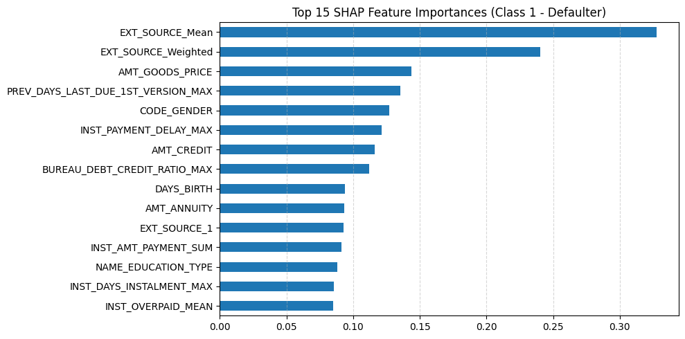

# 🏦 Home Credit Default Risk Prediction

This project uses machine learning to predict the probability that a client will **default on a loan**, based on demographic, credit history, and behavioral data provided by Home Credit.

---

## 📌 Problem Statement

Financial institutions face significant risk when issuing loans to customers. The goal is to build a model that predicts **loan default** using structured data from the **Home Credit Default Risk** competition on Kaggle.

---

## 📁 Dataset

- **Source**: [Home Credit Default Risk - Kaggle](https://www.kaggle.com/competitions/home-credit-default-risk)
- Multiple CSVs including:
  - `application_train.csv`
  - `bureau.csv`, `previous_application.csv`, `installments_payments.csv`, `credit_card_balance.csv`, etc.

---

## 📊 Exploratory Data Analysis (EDA)

- Class imbalance visualization
- Income, credit, and age distributions
- Feature correlation heatmap
- Missing value analysis

---

## 🧪 Feature Engineering

- Aggregated external files using `groupby` (e.g., bureau, previous applications)
- Created features like:
  - `BUREAU_CREDIT_MEAN`
  - `PREV_REJECTED_MEAN`
  - `INST_PAYMENT_DELAY_MAX`
  - And many more...
- Handled missing data with threshold-based removal

---

## ⚖️ Handling Class Imbalance

- Used `class_weight='balanced'` in LightGBM
- Also experimented with `SMOTE` oversampling

---

## 🧠 Model Used

- ✅ **LightGBMClassifier** with hyperparameters:
  ```python
  n_estimators=1000,
  learning_rate=0.05,
  class_weight='balanced',
  objective='binary',
  ```

---

## 🎯 Model Performance

| Metric       | Score |
|--------------|-------|
| ROC-AUC      | ~0.78 |
| Precision    | 0.23  |
| Recall       | 0.56  |
| Final Threshold | 0.55 |

> Focused on **higher recall** to catch more defaulters.

---

## 📈 SHAP Interpretation

- Used **SHAP (TreeExplainer)** to interpret model
- Top contributing features:
  - `EXT_SOURCE_MEAN`, `EXT_SOURCE_1`
  - `DAYS_BIRTH`
  - `AMT_GOODS_PRICE`



---

## 🧰 Requirements

```bash
pip install -r requirements.txt
```

> Includes: `lightgbm`, `scikit-learn`, `shap`, `pandas`, `matplotlib`, `seaborn`, etc.

---

## 🚀 How to Run

```bash
# Clone the repo
git clone https://github.com/Tanmay4440/loan-default-prediction
cd home-credit-default-risk

# Run notebook
jupyter notebook HomeCredit_DefaultRisk.ipynb
```

---

## 📝 Notes

- You must add your `kaggle.json` to download data (instructions in notebook).
- Final model is trained after all feature engineering steps.

---

## 📌 Project Status

✅ Complete with:
- Clean EDA
- Feature engineering
- Balanced model
- Model evaluation
- SHAP explanation
- GitHub polish

---

## 👤 Author

- **TANMAY GAURAV**
- GitHub: [Tanmay4440](https://github.com/Tanmay4440)
